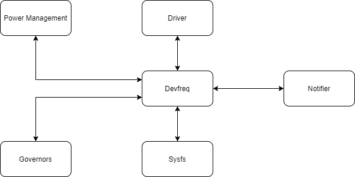

# Devfreq框架

# 简介
如何减少系统功耗，一直以来是计算机领域的研究热点。针对这一问题，硬件厂商推出了各种DVFS(Dynamic Voltage/Frequency Scaling)设备。这类设备可以根据需求动态调整工作电压和频率，提高系统能效。在这样的背景下，内核需要一套完整的方案来评测设备负载并及时调整其工作频率。Devfreq框架正是为了解决这一问题而产生。\
为了达成这一目标，devfreq框架通过设备驱动模型获取设备相关信息并对这些设备进行管理。不同设备的调频策略存在很大差异，类似cpu governer的插件机制被引入以解决该问题。最后devfreq通过sysfs，debugfs向用户空间提供了操作和管理这些设备的手段。\
devfreq框架的设计模型如下:\

\


# 设备描述
## struct devfreq_dev_profile
具体的硬件设备如何控制，一般由配套的驱动代码实现，这些驱动千差万别。为了能够以一致的方式管理和操控这些设备，devfreq采用了类似于反向依赖的方式定义了struct devfreq_dev_profile结构，用于描述具体的硬件设备。该结构定义在include/linux/devfreq.h，规范了devfreq框架与具体设备之间的接口协议，一般由设备驱动的probe函数(比如exynos_bus_probe)负责构造并传递给devfreq框架。

类型                                                            名称            说明
----                                                            ----            ----
unsigned long                                                   initial_freq    用于在devfreq_add_device函数执行时初始化频率信息
unsigned int                                                    polling_ms      评估设备状态的时间周期
int (*)(struct device *dev, unsigned long *freq, u32 flags)     target          设置设备频率，由具体的设备驱动提供该接口
int (*)(struct device *dev, struct devfreq_dev_status *stat)    get_dev_status  获取设备自上次评测后的运行信息，由governor通过devfreq_update_stats函数间接调用，主要用于governor评估设备负载，决定目标频率
int (*)(struct device *dev, unsigned long *freq)                get_cur_freq    获取当前频率
void (*)(struct device *dev)                                    exit            用于在devfreq设备注销时，通知设备驱动
unsigned long *                                                 freq_table      存储了设备支持的工作频率，这些信息在devfreq设备注册时通过OPP(Operating Performance Points)框架提供的接口查询获得。
unsigned int                                                    max_state       用于表示上述freq_table结构中存储的频率个数

## struct devfreq
Devfreq框架内部通过struct devfreq结构描述一个具体的devfreq设备，该结构同样定义在include/linux/devfreq.h。

类型                               名称                 说明
----                               ----                 ----
struct device                      dev                  devfreq设备的struct device实例
struct devfreq_dev_profile *       profile              devfreq设备操控的底层设备
const struct devfreq_governor *    governor             当前governor
char [DEVFREQ_NAME_LEN]            governor_name        governor名称
struct notifier_block              nb                   用于监控OPP消息
struct delayed_work                work                 monitor使用该结构执行周期性任务
unsigned long                      previous_freq        最近一次设置的设备频率，与devfreq_dev_profile结构中的freq_table对齐
struct devfreq_dev_status          last_status          设备的最新状态
void *                             data                 governor使用的扩展参数，devfreq框架不直接使用
struct dev_pm_qos_request          user_min_freq_req    devfreq框架对最小频率的约束    
struct dev_pm_qos_request          user_max_freq_req    devfreq框架对最大频率的约束
unsigned long                      scaling_min_freq     设备允许的最小工作频率，综合了PM QoS以及OPP对设备的频率约束
unsigned long                      scaling_max_freq     设备允许的最大工作频率，综合了PM QoS以及OPP对设备的频率约束
bool                               stop_polling         monitor状态
unsigned long                      suspend_freq         设备以固定频率suspend
unsigned long                      resume_freq          保存设备resume时需要恢复的频率
atomic_t                           suspend_count        suspend次数
struct devfreq_stats               stats                设备运行的统计信息
struct srcu_notifier_head          transition_notifier_list
struct notifier_block              nb_min
struct notifier_block              nb_max

# devfreq与驱动模型
## devfreq设备的创建
devfreq设备的创建由devfreq_add_device函数实现，该函数使用如下参数:

* dev: 需要增加devfreq功能的设备
* profile: 用于支持devfreq框架的profile结构，由设备提供
* governor_name: governer名称
* data: governor使用的扩展参数，devfreq框架不直接使用

devfreq_add_device函数的主要步骤如下:

1. 调用find_device_devfreq查看dev是否已经注册了devfreq设备，如果devfreq设备已存在，返回-EINVAL 
2. 为devfreq设备分配内存并初始化，devfreq->dev.parent设定为dev，步骤1中的find_device_devfreq正是通过比对两者是否一致来判断devfreq设备是否已经存在。
3. 如果dev->profile->freq_table还没有配置，调用set_freq_table初始化该结构并设置profile->max_state
4. 调用find_available_min(max)_freq获取设备支持的最小(最大)工作频率并保存到devfreq->scaling_min(max)_freq
5. 通过device_register将devfreq->dev注册到驱动设备框架
6. 初始化devfreq->stats，用于存储相关的统计信息，包括在每个状态的存续时间，状态迁移的次数等
7. 调用dev_pm_qos_add_request增加对dev工作频率的约束，最小值设为0，最大值设置为PM_QOS_MAX_FREQUENCY_DEFAULT_VALUE。约束信息保存在devfreq->user_min(max)_freq_req，用户空间可以通过sysfs写入max/min_freq修改这些信息。改动通过dev_pm_qos_update_request接口应用到PM框架。
8. 通过dev_pm_qos_add_notifier注册监听函数，监测其他模块对于dev工作频率的约束，收到通知后调用update_devfreq更新设备频率。
9. 根据governor_name找到合适的governor并通知governor启动，如果没有找到对应的governor则返回相应的错误值。
10. 将devfreq添加到全局的devfreq_list列表中

## PM QoS & OPP

# governor
## struct devfreq_governor
## 注册&注销
## devfreq_monitor机制
devfreq设备需要周期性的评估设备工作状态并调整频率，因此devfreq框架基于workqueue设计了一组通用函数，用于实现该功能。该功能可以通过设置governor->interrupt_driven来屏蔽。governer也可以实现自己的监控机制。一个名为devfreq_wq的专用workqueue在系统初始化时由devfreq_init函数创建。

* devfreq_monitor_start: 启动设备负载监测，调用queue_delayed_work向devfreq_wq添加一个延迟devfreq->profile->polling_ms的work
* devfreq_monitor: 负责周期性的评估负载并更新设备并重新向devfreq_wq添加一个新的work。这样就确保了devfreq_monitor函数的周期性调用
* devfreq_monitor_stop: 停止设备负载监测
* devfreq_monitor_suspend: 暂停负载监测并调用devfreq_update_status更新统计信息
* devfreq_monitor_resume: 恢复负载监测并调用devfreq_update_status更新统计信息

# devfreq与用户空间
## sysfs
devfreq框架引入了一个新的class类型devfreq_class。模块初始化时，调用class_create函数在/sys/class目录下增加了devfreq目录。devfreq_class定义了一组通用属性，添加devfreq设备时，对应的sysfs文件目录下会创建相应的文件接口，供用户空间查看/操作devfreq设备。每个文件读写的功能如下表:

名称                         读                              写
----                         ----                            ----
name                         设备名称                        NA
governor                     当前governor名称                修改governor
available_governors          可选的governor名称              NA
available_frequencies        可设置的设备频率                NA
cur_freq                     当前设备频率                    NA
target_freq                  最近一次设置时的请求频率        NA
polling_interval             负载监测周期，以ms为单位        通知governor监测周期变更
min_freq                     设备允许的最小频率              更新devfreq模块对设备最小频率的约束
max_freq                     设备允许的最大频率              更新devfreq模块对设备最大频率的约束
trans_stat                   列出设备频率调整的统计信息      重置统计信息

上表中的target_freq必须是available_frequencies中的一种，devfreq计算trans_stat数据时也是以此为准。cur_freq则未必等同于target_freq，取决于具体的硬件能否配置成target_freq。\
对polling_interval文件的写入并不直接修改polling_interval，而是通过governor的event_handler接口进行通知。governor在收到该请求并决策后调用devfreq_interval_update函数实际更新监测周期。\
对于min(max)_freq的写入，devfreq框架需要与PM QoS模块合作。参考[devfreq设备的创建](# devfreq设备的创建)，更新保存在devfreq->user_min(max)_freq_req结构中的约束信息并通知PM QoS模块。由于我们在devfreq设备创建的时候监听了PM QoS的变更消息，对于min(max)_freq的写入会间接的更新设备频率。读取的时候devfreq也会读取PM QoS对于设备频率的总体约束并返回结果。\
读取trans_stat会详细列出设备从频率A迁移到频率B的次数，各频率的持续时间，以及总的迁移次数。*所在行表示当前频率。这里列出了一个具体设备的trans_stat信息:

```
     From  :   To
           :      2288      4577      7110      9155     12298     14236     16265   time(ms)
*      2288:         0         0         0     41462         0         0         0  42535428
       4577:         0         0         0         0         0         0         0         0
       7110:         0         0         0         0         0         0         0         0
       9155:     41463         0         0         0         0         0         0   8900392
      12298:         0         0         0         0         0         0         0         0
      14236:         0         0         0         0         0         0         0         0
      16265:         0         0         0         1         0         0         0     60856
Total transition : 82926

```

# debugfs接口
TODO

# 其他
## notifier
由于设备功能类似，统一的框架可以有效的规范代码结构，提高代码复用。在这样的背景下，Devfreq机制应运而生，旨在为linux支持的DVFS设备提供一套通用的框架和接口。\
为了动态调整频率，必须周期性的测量和评估设备的负载情况，然后对设备进行调整。对于不同的设备，调整电压/频率的策略可能大相径庭。因此Devfreq采用了类似cpu governer的机制，具体的调整策略由devfreq_governor负责。与此同时，通过引入struct devfreq_dev_profile结构统一对具体设备的描述，devfreq能够以一致的方式管理和操作这些设备。这样的设计在提高代码复用的同时提供了最大程度的灵活性，有效实现了对DVFS设备的支持。
Devfreq与设备驱动，电源管理有着密切的联系。一般来说，设备驱动在probe接口中创建devfreq设备。devfreq设备对频率的具体调整需要整合PM QoS以及OPP模块对于设备的管控。对于PM QoS消息，devfreq设备在创建的过程中会主动监听并做相应的处理。针对OPP，则由驱动根据需要决策，devfreq框架提供了相应的接口注册监听并处理。此外，devfreq设备还通过sysfs接口给用户空间提供了操作管理这类设备的手段。对于希望监听devfreq设备消息的模块，devfreq框架同样提供了notifier机制。

# 附录
## 附录1: 函数说明
```
static struct devfreq *find_device_devfreq(struct device *dev)
static unsigned long find_available_min_freq(struct devfreq *devfreq)
static unsigned long find_available_max_freq(struct devfreq *devfreq)
static void get_freq_range(struct devfreq *devfreq,
			   unsigned long *min_freq,
			   unsigned long *max_freq)
static int devfreq_get_freq_level(struct devfreq *devfreq, unsigned long freq)
static int set_freq_table(struct devfreq *devfreq)
int devfreq_update_status(struct devfreq *devfreq, unsigned long freq)
static struct devfreq_governor *find_devfreq_governor(const char *name)
static struct devfreq_governor *try_then_request_governor(const char *name)
static int devfreq_notify_transition(struct devfreq *devfreq,
		struct devfreq_freqs *freqs, unsigned int state)
static int devfreq_set_target(struct devfreq *devfreq, unsigned long new_freq,
			      u32 flags)
int update_devfreq(struct devfreq *devfreq)
static void devfreq_monitor(struct work_struct *work)
void devfreq_monitor_start(struct devfreq *devfreq)
void devfreq_monitor_stop(struct devfreq *devfreq)
void devfreq_monitor_suspend(struct devfreq *devfreq)
void devfreq_monitor_resume(struct devfreq *devfreq)
void devfreq_interval_update(struct devfreq *devfreq, unsigned int *delay)
static int devfreq_notifier_call(struct notifier_block *nb, unsigned long type,
				 void *devp)
static int qos_notifier_call(struct devfreq *devfreq)
static int qos_min_notifier_call(struct notifier_block *nb,
					 unsigned long val, void *ptr)
static int qos_max_notifier_call(struct notifier_block *nb,
					 unsigned long val, void *ptr)
static void devfreq_dev_release(struct device *dev)
struct devfreq *devfreq_add_device(struct device *dev,
				   struct devfreq_dev_profile *profile,
				   const char *governor_name,
				   void *data)
int devfreq_remove_device(struct devfreq *devfreq)
static int devm_devfreq_dev_match(struct device *dev, void *res, void *data)
static void devm_devfreq_dev_release(struct device *dev, void *res)
struct devfreq *devm_devfreq_add_device(struct device *dev,
					struct devfreq_dev_profile *profile,
					const char *governor_name,
					void *data)
struct devfreq *devfreq_get_devfreq_by_phandle(struct device *dev, int index)
void devm_devfreq_remove_device(struct device *dev, struct devfreq *devfreq)
int devfreq_suspend_device(struct devfreq *devfreq)
int devfreq_resume_device(struct devfreq *devfreq)
void devfreq_suspend(void)
void devfreq_resume(void)
int devfreq_add_governor(struct devfreq_governor *governor)
int devfreq_remove_governor(struct devfreq_governor *governor)
static ssize_t name_show(struct device *dev,
			struct device_attribute *attr, char *buf)
static ssize_t governor_show(struct device *dev,
			     struct device_attribute *attr, char *buf)
static ssize_t governor_store(struct device *dev, struct device_attribute *attr,
			      const char *buf, size_t count)
static ssize_t available_governors_show(struct device *d,
					struct device_attribute *attr,
					char *buf)
static ssize_t cur_freq_show(struct device *dev, struct device_attribute *attr,
			     char *buf)
static ssize_t target_freq_show(struct device *dev,
				struct device_attribute *attr, char *buf)
static ssize_t polling_interval_show(struct device *dev,
				     struct device_attribute *attr, char *buf)
static ssize_t polling_interval_store(struct device *dev,
				      struct device_attribute *attr,
				      const char *buf, size_t count)
static ssize_t min_freq_store(struct device *dev, struct device_attribute *attr,
			      const char *buf, size_t count)
static ssize_t min_freq_show(struct device *dev, struct device_attribute *attr,
			     char *buf)
static ssize_t max_freq_store(struct device *dev, struct device_attribute *attr,
			      const char *buf, size_t count)
static ssize_t max_freq_show(struct device *dev, struct device_attribute *attr,
			     char *buf)
static ssize_t available_frequencies_show(struct device *d,
					  struct device_attribute *attr,
					  char *buf)
static ssize_t trans_stat_show(struct device *dev,
			       struct device_attribute *attr, char *buf)
static ssize_t trans_stat_store(struct device *dev,
				struct device_attribute *attr,
				const char *buf, size_t count)
static int devfreq_summary_show(struct seq_file *s, void *data)
static int __init devfreq_init(void)
struct dev_pm_opp *devfreq_recommended_opp(struct device *dev,
					   unsigned long *freq,
					   u32 flags)
int devfreq_register_opp_notifier(struct device *dev, struct devfreq *devfreq)
int devfreq_unregister_opp_notifier(struct device *dev, struct devfreq *devfreq)
static void devm_devfreq_opp_release(struct device *dev, void *res)
int devm_devfreq_register_opp_notifier(struct device *dev,
				       struct devfreq *devfreq)
void devm_devfreq_unregister_opp_notifier(struct device *dev,
					 struct devfreq *devfreq)
int devfreq_register_notifier(struct devfreq *devfreq,
			      struct notifier_block *nb,
			      unsigned int list)
int devfreq_unregister_notifier(struct devfreq *devfreq,
				struct notifier_block *nb,
				unsigned int list)
static void devm_devfreq_notifier_release(struct device *dev, void *res)
int devm_devfreq_register_notifier(struct device *dev,
				struct devfreq *devfreq,
				struct notifier_block *nb,
				unsigned int list)
void devm_devfreq_unregister_notifier(struct device *dev,
				      struct devfreq *devfreq,
				      struct notifier_block *nb,
				      unsigned int list)
```

## 附录2：术语表
名称     说明
----     ----
DVFS
OPP
PM QoS
