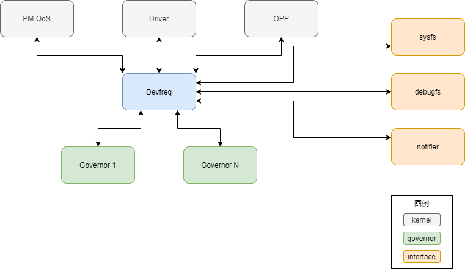

# Devfreq框架

# 简介
如何减少系统功耗，一直以来是计算机领域的研究热点。针对这一问题，硬件厂商推出了各种DVFS(Dynamic Voltage/Frequency Scaling)设备。这类设备功能可以根据负载动态调整工作电压和频率，提高系统能效。由于设备功能类似，统一的框架可以有效的规范代码结构，提高代码复用。在这样的背景下，Devfreq机制应运而生，旨在为linux支持的DVFS设备提供一套通用的框架和接口。\
为了实现动态调整电压/频率的目标，必须周期性的测量和评估设备的负载情况，然后动态的对设备进行调整。对于不同的设备，调整电压/频率的策略可能大相径庭。因此Devfreq采用了类似cpu governer的机制，具体的调整策略由devfreq_governor负责。与此同时，通过引入struct devfreq_dev_profile结构统一对具体设备的描述，devfreq能够以一致的方式管理和操作这些设备。这样的设计在提高代码复用的同时提供了最大程度的灵活性，有效实现了对DVFS设备的支持。Devfreq框架与系统中其他模块的关系如下:\

# struct devfreq_dev_profile
struct devfreq_dev_profile描述具体的硬件设备，相当于Devfreq框架与具体设备之间的接口协议。该结构定义在include/linux/devfreq.h，一般由设备驱动的probe函数(比如exynos_bus_probe)负责构造并传递给devfreq框架。

类型                                                            名称            说明
----                                                            ----            ----
unsigned long                                                   initial_freq    用于在devfreq_add_device函数执行时初始化频率信息
unsigned int                                                    polling_ms      评估设备状态的时间周期
int (*)(struct device *dev, unsigned long *freq, u32 flags)     target          设置设备频率，由具体的设备提供该接口
int (*)(struct device *dev, struct devfreq_dev_status *stat)    get_dev_status  获取设备自上次测量后的运行信息，由governor通过devfreq_update_stats函数间接调用，主要用于governor评估设备负载，决定目标频率
int (*)(struct device *dev, unsigned long *freq)                get_cur_freq    获取当前频率
void (*)(struct device *dev)                                    exit            用于在devfreq设备注销时，通知底层设备
unsigned long *                                                 freq_table      存储了设备支持的工作频率，这些信息在devfreq设备注册时通过OPP(Operating Performance Points)框架提供的接口查询获得。
unsigned int                                                    max_state       用于表示上述freq_table结构中存储的频率个数

# struct devfreq
Devfreq框架内部通过struct devfreq结构表示devfreq设备，同样定义在include/linux/devfreq.h。

类型                               名称            说明
----                               ----            ----
struct device                      dev
struct devfreq_dev_profile *       profile
const struct devfreq_governor *    governor
char [DEVFREQ_NAME_LEN]            governor_name
struct notifier_block              nb
struct delayed_work                work
unsigned long                      previous_freq
struct devfreq_dev_status          last_status
void *                             data
struct dev_pm_qos_request          user_min_freq_req
struct dev_pm_qos_request          user_max_freq_req
unsigned long                      scaling_min_freq
unsigned long                      scaling_max_freq
bool                               stop_polling
unsigned long                      suspend_freq
unsigned long                      resume_freq
atomic_t                           suspend_count
struct devfreq_stats               stats
struct srcu_notifier_head          transition_notifier_list
struct notifier_block              nb_min
struct notifier_block              nb_max

# devfreq设备的创建
devfreq设备的创建由devfreq_add_device函数实现，该函数使用如下参数:

* dev: 需要增加devfreq功能的设备
* profile: 用于支持devfreq框架的profile结构，由设备提供
* governor_name: governer名称
* data: governor使用的扩展参数，devfreq框架不直接使用

devfreq_add_device函数的主要步骤如下:

1. 调用find_device_devfreq查看dev是否已经注册了devfreq设备，如果devfreq设备已存在，返回-EINVAL 
2. 为devfreq设备分配内存并初始化，devfreq->dev.parent设定为dev，步骤1中的find_device_devfreq正是通过比对两者是否一致来判断devfreq设备是否已经存在。
3. 如果dev->profile->freq_table还没有配置，调用set_freq_table初始化该结构并设置profile->max_state
4. 调用find_available_min(max)_freq获取设备支持的最小(最大)工作频率并保存到devfreq->scaling_min(max)_freq
5. 通过device_register将devfreq->dev注册到驱动设备框架
6. 初始化devfreq->stats，用于存储相关的统计信息，包括在每个状态的存续时间，状态迁移的次数等
7. 调用dev_pm_qos_add_request增加对dev工作频率的约束，最小值设为0，最大值设置为PM_QOS_MAX_FREQUENCY_DEFAULT_VALUE。约束信息保存在devfreq->user_min(max)_freq_req，用户空间可以通过sysfs写入max/min_freq修改这些信息。改动通过dev_pm_qos_update_request接口应用到PM框架。
8. 通过dev_pm_qos_add_notifier注册监听函数，监测其他模块对于dev工作频率的约束，收到通知后调用update_devfreq更新设备频率。
9. 根据governor_name找到合适的governor并通知governor启动，如果没有找到对应的governor则返回相应的错误值。
10. 将devfreq添加到全局的devfreq_list列表中

# devfreq_monitor机制
devfreq设备需要周期性的评估设备工作状态并调整频率，因此devfreq框架基于workqueue设计了一组通用函数，用于实现该功能。该功能可以通过设置governor->interrupt_driven来屏蔽。
* devfreq_monitor_start: 启动设备负载监测，调用queue_delayed_work向devfreq_wq添加一个延迟devfreq->profile->polling_ms的work
* devfreq_monitor: 负责周期性的评估负载并更新设备并重新向devfreq_wq添加一个新的work。这样就确保了devfreq_monitor函数的周期性调用
* devfreq_monitor_stop: 停止设备负载监测
* devfreq_monitor_suspend: 暂停负载监测并调用devfreq_update_status更新统计信息
* devfreq_monitor_resume: 恢复负载监测并调用devfreq_update_status更新统计信息
