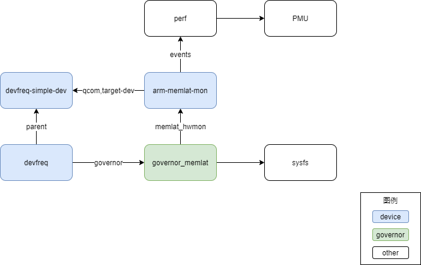

# Devfreq Governor之memlat

# 1. 引言
memory latency governor是高通开发的一种devfreq governor，借助PMU分析workload是否为memory latency bound并根据需要调整DDR的工作频率。这部分代码没有合入Linux内核主分支，AOSP开源了这部分代码，使用下面的命令获取：
```
repo init -u https://android.googlesource.com/kernel/manifest -b android-msm-coral-4.14-android10-qpr3
```
获取最新的代码可以参考https://source.android.com/setup/build/building-kernels。memlat governor并不是单纯的算法逻辑，需要借助PMU分析系统的相关指标。其设计原理可以参考下图:\
\


# 2. 硬件配置与描述
## hardware monitor
memlat governor的运转需要相应的hardware monitor来获取性能信息。这部分被抽象成统一的数据结构struct memlat_hwmon。governor通过该结构和硬件打交道。hardware monitor的参数被配置在DTS的compatible属性为qcom,arm-memlat-mon的节点中。该节点存储了PMU事件编号，CPU频率到设备频率的转换表，目标设备以及作用的CPU范围等参数。
以arch/arm64/boot/dts/qcom/sm8150.dtsi文件为参考，一个典型的memlat设备DTS配置如下:\
```
&soc {
    cpu0_cpu_l3_lat: qcom,cpu0-cpu-l3-lat {
        compatible = "devfreq-simple-dev";
        clock-names = "devfreq_clk";
        clocks = <&clock_cpucc L3_CLUSTER0_VOTE_CLK>;
        governor = "performance";
    };   

    cpu0_cpu_l3_latmon: qcom,cpu0-cpu-l3-latmon {
        compatible = "qcom,arm-memlat-mon";
        qcom,cpulist = <&CPU0 &CPU1 &CPU2 &CPU3>;
        qcom,target-dev = <&cpu0_cpu_l3_lat>;
        qcom,cachemiss-ev = <0x17>;
        qcom,core-dev-table =
            <  300000  300000000 >,
            <  480000  403200000 >,
            <  672000  480000000 >,
            <  768000  576000000 >,
            <  864000  672000000 >,
            <  979200  768000000 >,
            < 1075200  864000000 >,
            < 1267200  960000000 >;
    };   
}
```

## struct memlat_hwmon
```
struct memlat_hwmon {                             
    int (*start_hwmon)(struct memlat_hwmon *hw);                        
    void (*stop_hwmon)(struct memlat_hwmon *hw);  
    unsigned long (*get_cnt)(struct memlat_hwmon *hw);     
    struct device_node *(*get_child_of_node)(struct device *dev);
    struct device *dev;              
    struct device_node *of_node;                                        
                                                   
    unsigned int num_cores;                       
    struct dev_stats *core_stats;                                     
                                                                     
    struct devfreq *df;             
    struct core_dev_map *freq_map;                         
};                            
```
